# 📚 Aplikasi Manajemen Buku Perpustakaan

Aplikasi web berbasis Laravel untuk membantu petugas perpustakaan dalam mengelola data buku, penulis, penerbit, dan tahun terbit. Dilengkapi dengan fitur autentikasi, antarmuka yang sederhana, dan navigasi yang mudah digunakan. Ini cuma Aplikasi buat diri saya sendiri, karena buku saya banyak banget. Tapi kalau kalian mau coba silahkan. 

---

## ✨ Fitur Utama

- ✅ Autentikasi (Login, Register, Logout)
- 📖 CRUD Data Buku
- 👤 CRUD Data Penulis (Author)
- 🏢 CRUD Data Penerbit
- 📅 CRUD Data Tahun Terbit
- 🔍 Relasi antar entitas (Buku ↔ Penulis, Penerbit, Tahun)
- 🎨 Antarmuka Bootstrap responsif
- 📂 Sidebar Navigasi

---

## ⚙️ Instalasi

### 1. Clone Repo
```
git clone https://github.com/Platotel3s/normal.git
cd nama-repo
```

### 2. Install Dependensi
```
composer install
npm install && npm run dev
```

### 3. Setup Environment
```
cp .env.example .env
php artisan key:generate
```

### 4. Konfigurasi Database
```
DB_CONNECTION=mysql
DB_HOST=127.0.0.1
DB_PORT=3306
DB_DATABASE=perpustakaan
DB_USERNAME=root
DB_PASSWORD=
```

### 5. Migrasi & Seed
```
php artisan migrate
php artisan db:seed
```
### 6. Jalankan Server
```
php artisan serve
```

### 7. 📸 Screenshot

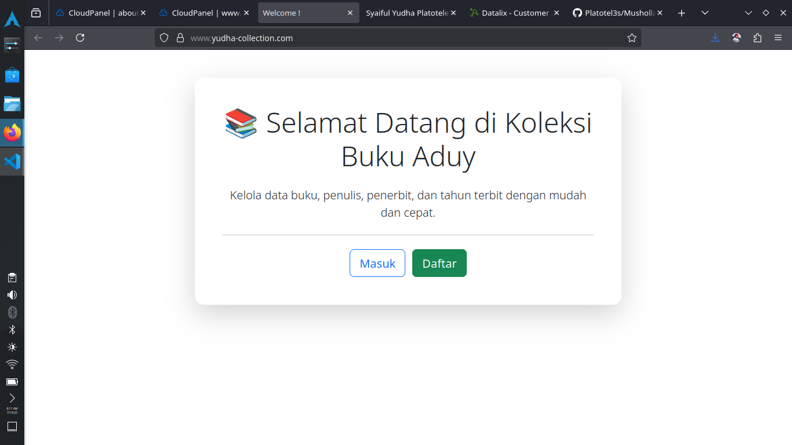
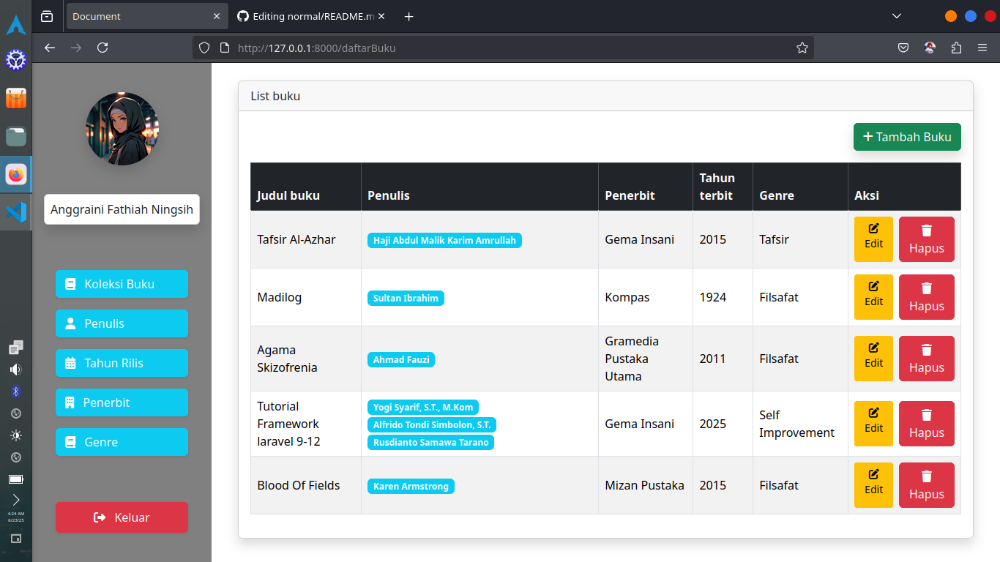
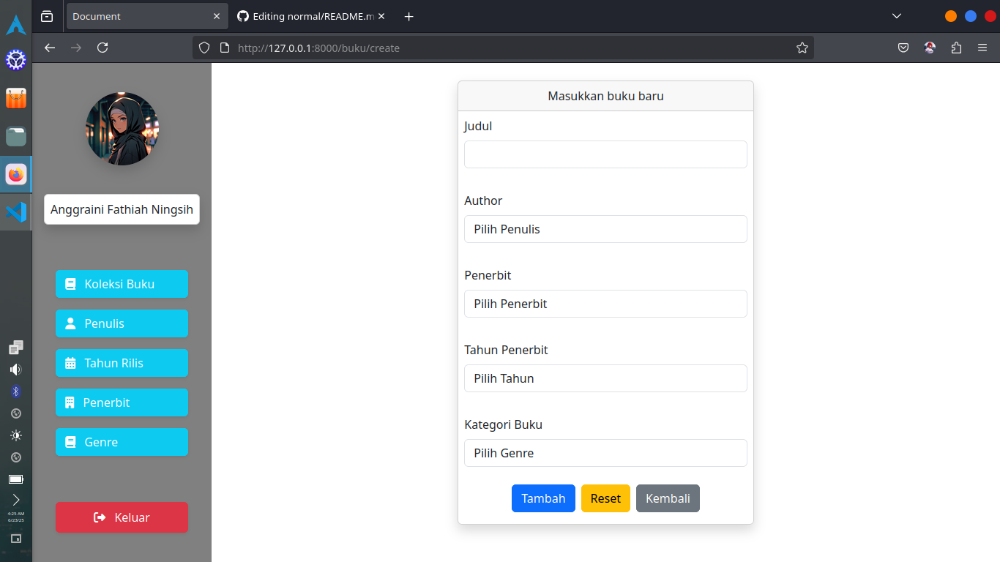
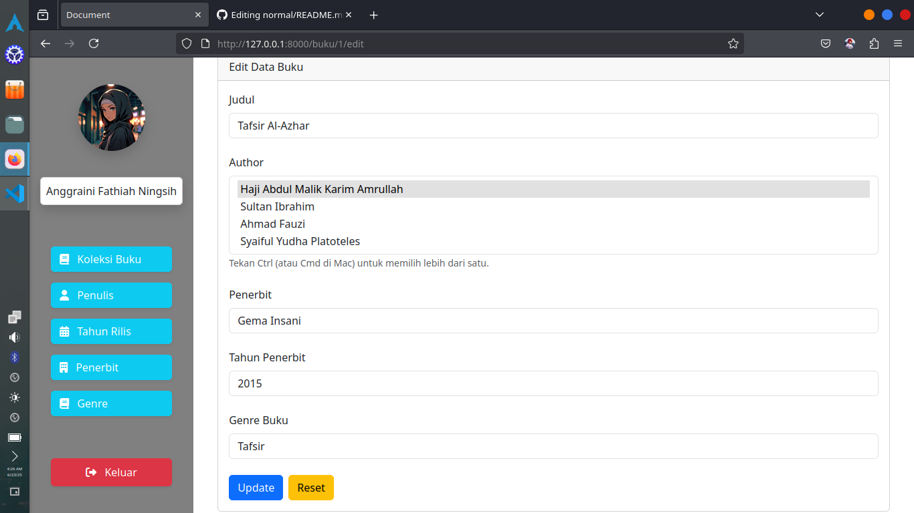
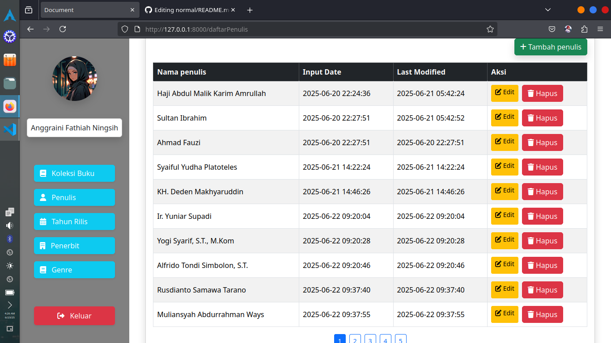

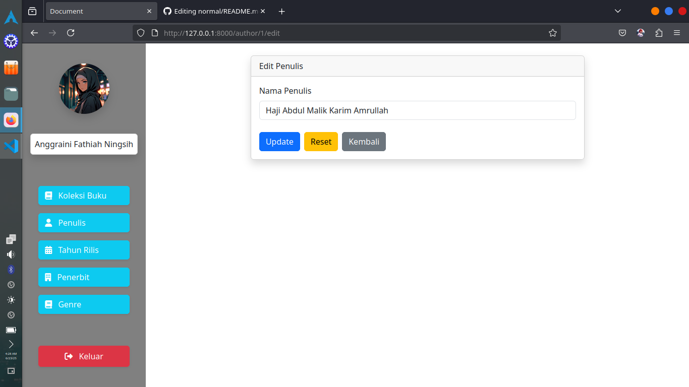
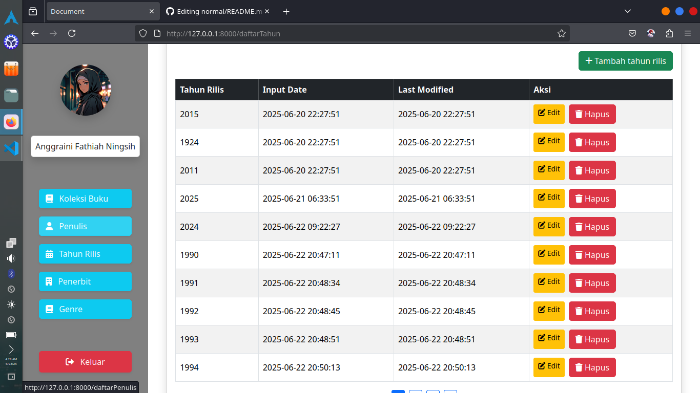
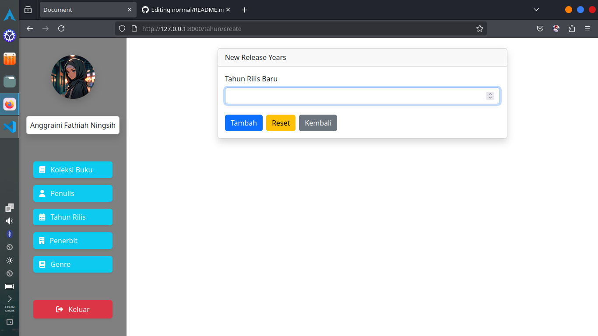
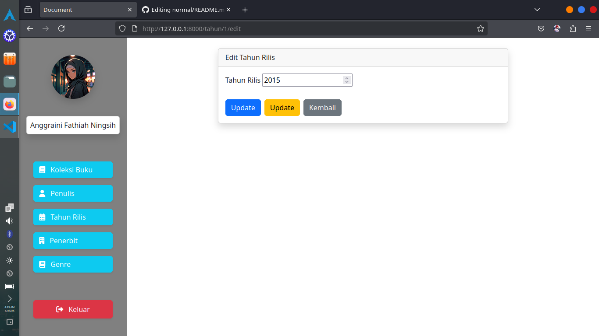
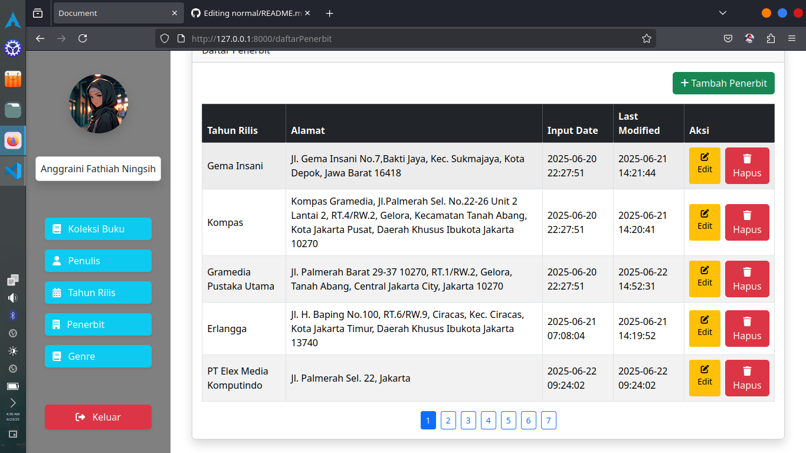
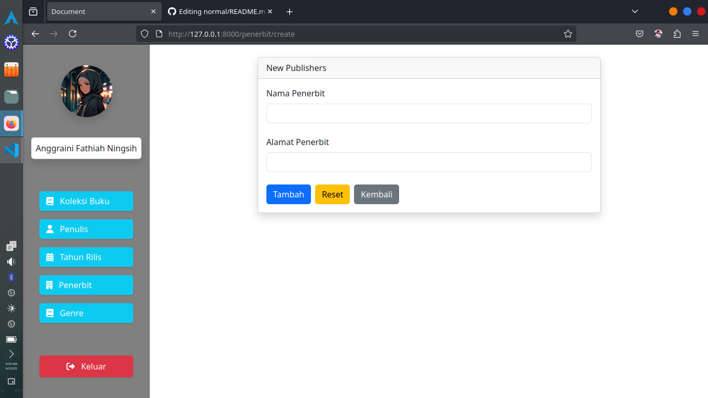
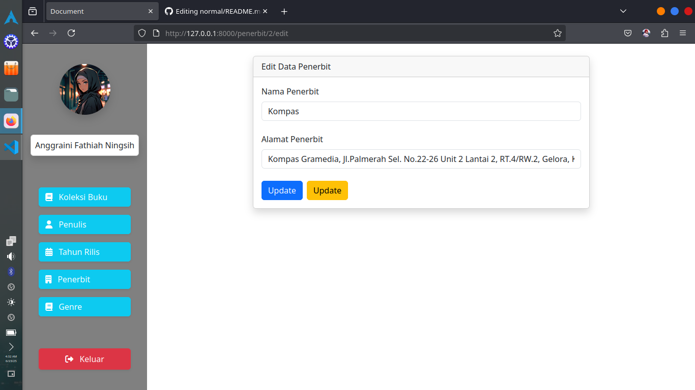
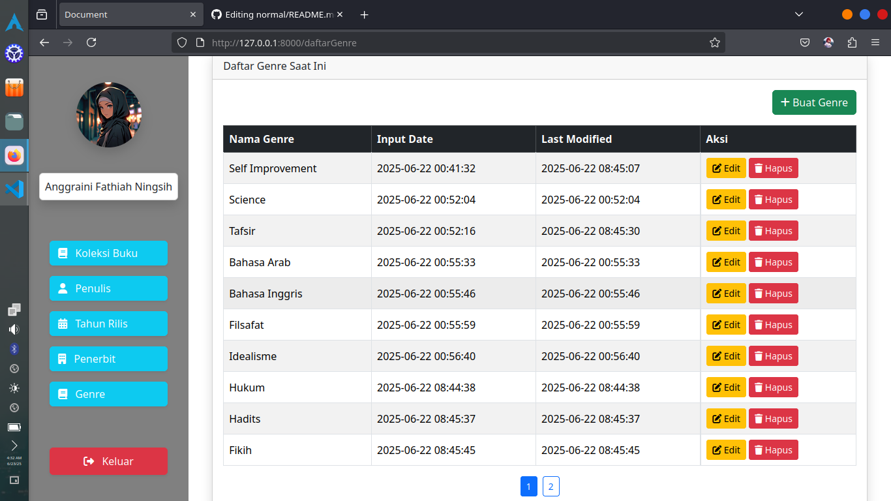
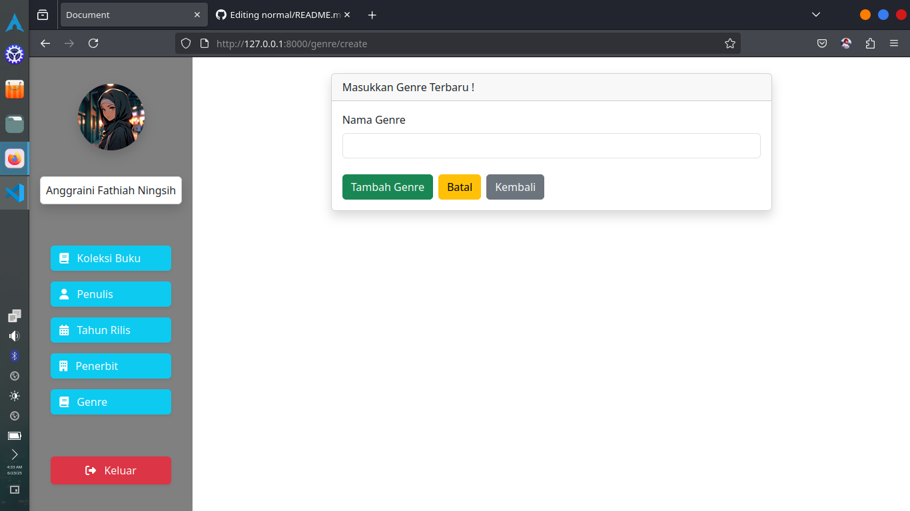


